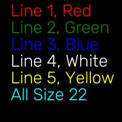

This sample code will display several unique templates on LCD display.
You can use these templates in your target application or define your
own template inside LCD class (lcd.py)

### How do I run it?

Step 1: Clone the repo

Step 2: Run `python3 lcd_example.py`

### LCD datasheet

[Datasheet]() for LCD display

### LCD Class

Shows lines with idepentant styling for each lines

```
    lcd.display([(1,"Line 1, Red",0,"red"), 
        (2,"Line 2, Green",0,"green"),
        (3,"Line 3, Blue ",0,"blue"),
        (4,"Line 4, White",0,"white"),
        (5,"Line 5, Yellow",0,(255,255,0)),
        (6,"All Size 22",0,(0,255,255))],
        22)
```

