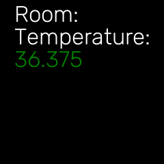

This sample code will take the temperature and show it on the LCD

### How do I run it?

Step 1: It is assumed that the ubo-sdk has been cloned in a home directory (/home/pi). Before running the examples, make sure that you activate the python virtual environment by running:

```$ source ~/ubo-venv/bin/activate```

In the temperature directory we have the following files. 

├── screen.png <- An image to show the way of displaying temp

├── temp_cpu.py <- this python program shows on the LCD the temperature of the CPU

└── temperature.py <- this python program shows on the LCD the ambient temperature


Step 2: Run `python3 temperature.py`

### Temperature sensor info:

[Datasheet](https://www.nxp.com/docs/en/data-sheet/PCT2075.pdf) for temprature sensor
[Adafruit PCT2075 Python Library](https://docs.circuitpython.org/projects/pct2075/en/latest/)

You shoud see on the LCD display something resembling this 




Step 3: Run `python3 temp-cpu.py`
	This shows the cpu temperature
	The method to obtain this cpu temperature is based on the command **vcgencmd** 
	To know more about this feature, look at the manual for this cmd.
	The man page for it can be seen by enteru

